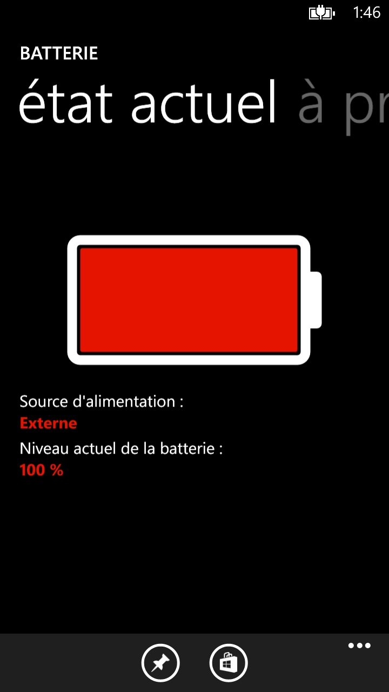
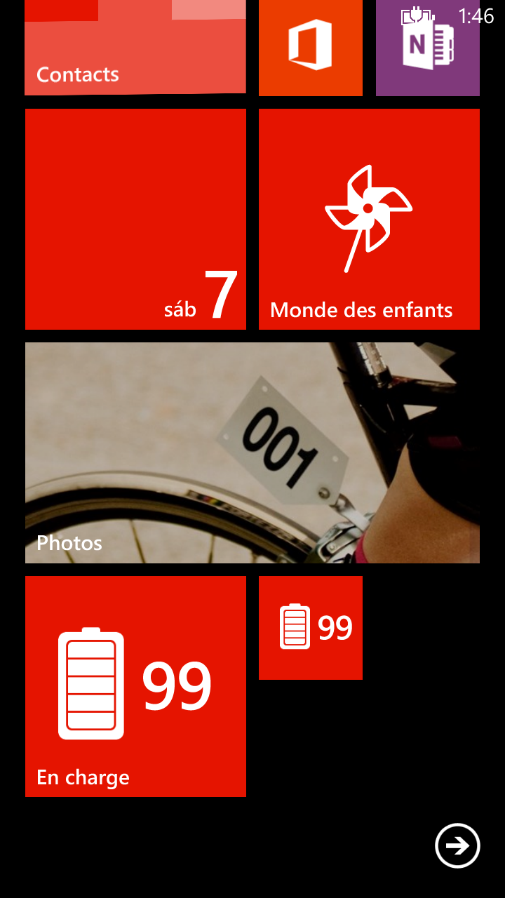
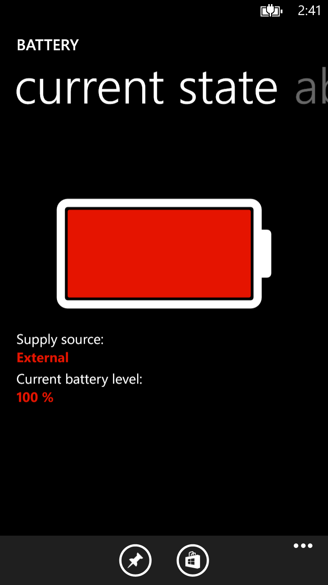

# Application Battery Light pour Windows Phone et Windows Mobile 10

A la suite de la fermeture du Store pour Windows 10 - je publie mes applis au cas où cela serait utile à quelqu'un.

L'application sur le store : [Battery Light](https://www.microsoft.com/store/apps/9WZDNCRDGNT6).

### Raison du projet

Ce projet est une autre tentative d'une app Windows Phone multilingue, plus précisément 5 langues et surtout d'avoir une app la plus légère possible.

### Description sur le store

```console
Battery light a pour unique vocation d'informer de l'état de la batterie. Il n'y a donc aucun paramètre, juste une tuile et des infos sur l'écran d'accueil.

Limitations : Windows Phone ne permettant pas de faire autrement, la tuile ne se rafraîchit que toutes les 15 minutes.
```

### Ouverture du projet

```console
Utilisez Microsoft Visual Studio 2013 avec le SDK Windows Phone 8.1
```

### Quelques captures

<p align="center">
 </br>
 
 &nbsp;
 
 &nbsp;
 
</p>